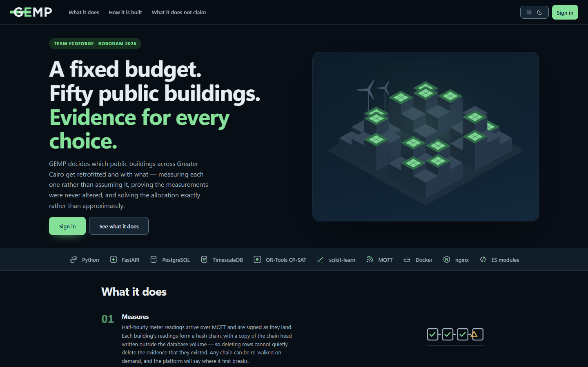
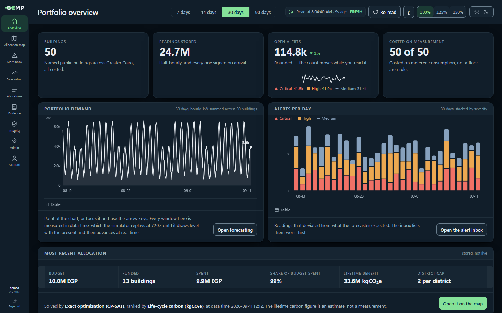
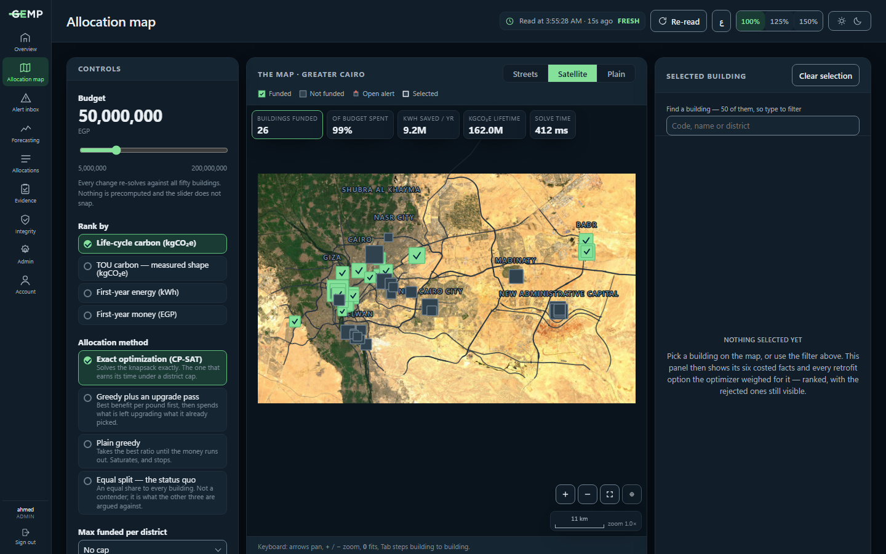
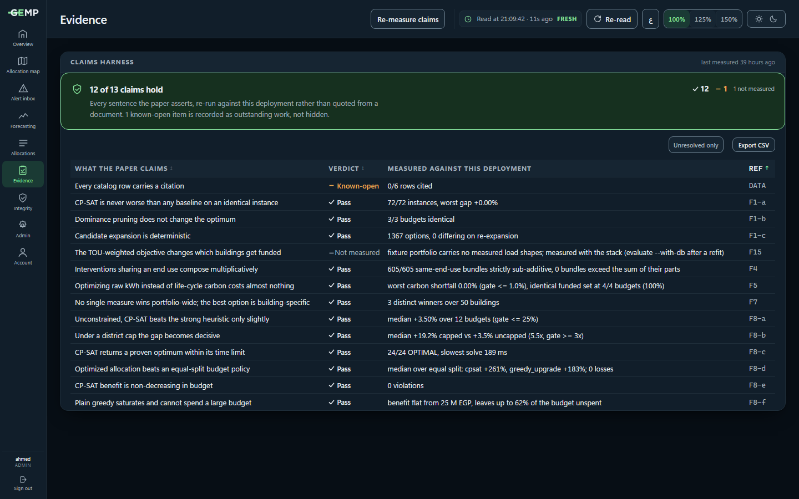
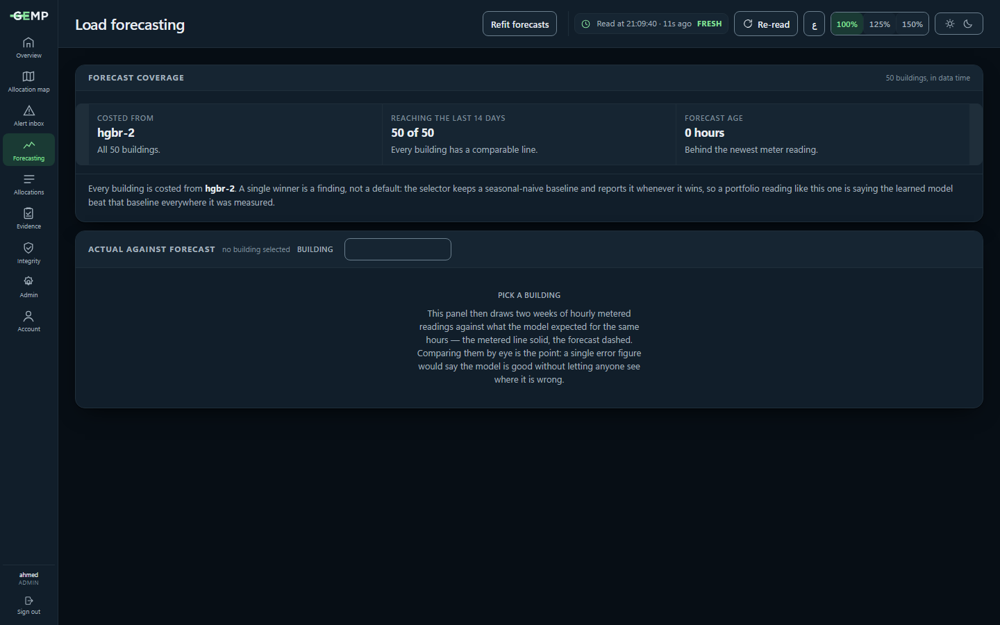
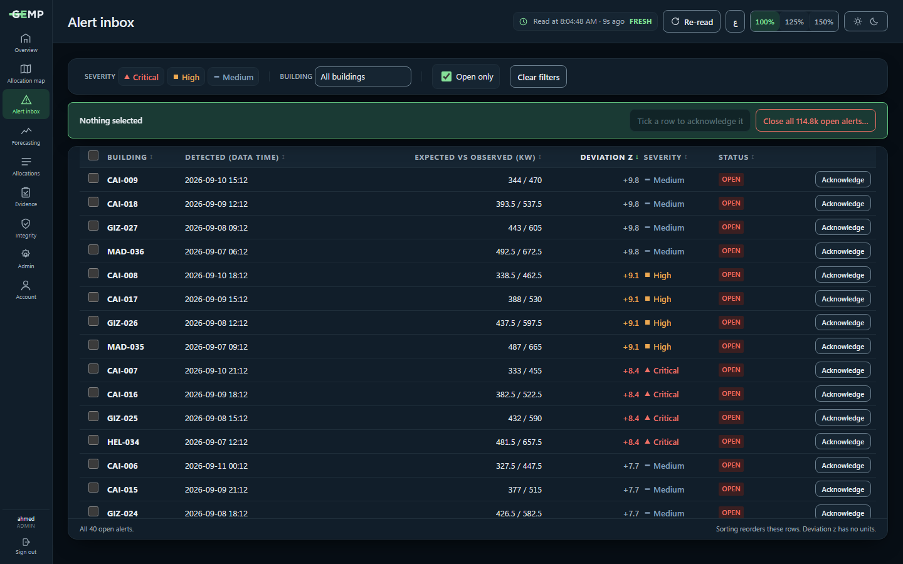
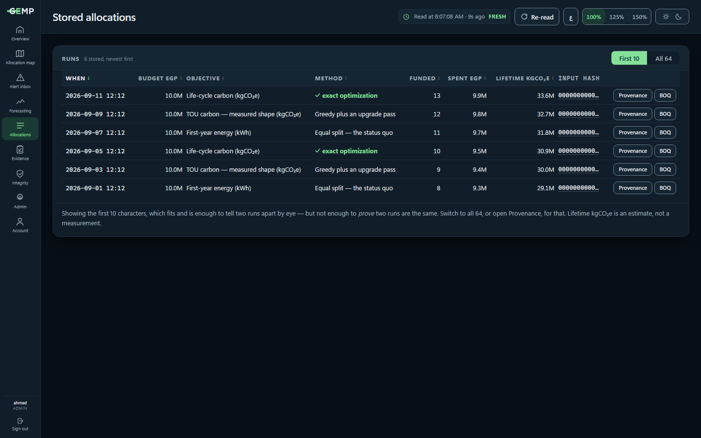
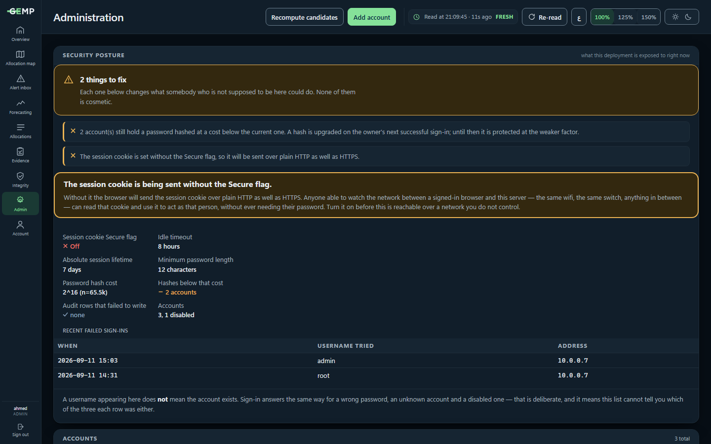

<div align="center">

# GEMP — Green Energy Monitoring Platform

**Measured, continuously verified retrofit decision support for public-sector building portfolios.**

Given fifty real, named public buildings, GEMP decides which get which retrofit —
measuring each one from its own meter rather than assuming it, proving the
measurements were never altered, and solving the allocation exactly rather than
approximately.

[](https://github.com/AhmadEbaid001/EcoForge/actions/workflows/ci.yml)
[](pyproject.toml)
[](src/gemp/optimize/ilp.py)
[](LICENSE)

RoboDam 2026 · Smart Systems track · Team Ecoforge — Ahmed Ebaid, Nada Wagdy



</div>

---

## This is not a monitoring dashboard

It is a budget allocator. Ingestion, forecasting, anomaly detection and the map exist to
feed one decision or to display it: **which buildings get funded, and why those and not
the others.**

Three commitments follow from that, and most of the engineering in this repository is
one of them being taken seriously.

| | |
|---|---|
| **Measured, not assumed** | Every building is costed from its own metered consumption. No floor-area rule of thumb standing in for a meter. |
| **Provable, not asserted** | Readings are HMAC-signed and hash-chained on arrival, with chain heads written outside the database volume. Any chain can be re-walked on demand, and the platform will say where it first breaks. |
| **Exact, and arguable** | The allocation is solved to a proven optimum by CP-SAT, and every screen shows the options that lost alongside the one that won. |

---

## Contents

- [Screens](#screens)
- [Quick start](#quick-start)
- [Results](#results)
- [Architecture](#architecture)
- [The data contract](#the-data-contract)
- [Design decisions worth knowing](#design-decisions-worth-knowing)
- [Testing, gates and CI](#testing-gates-and-ci)
- [Deployment](#deployment)
- [Status](#status)
- [Limitations](#limitations)
- [Authors and licence](#authors-and-licence)

---

## Screens

> Captured from the development harness against representative data, not from a
> production instance — the figures in them are illustrative. The claims the platform
> makes about itself are measured live, on the Evidence screen.

### Portfolio overview

Where the portfolio stands: buildings costed, readings stored, alerts open, and the most
recent stored allocation. Every window is measured in **data time**, which the simulator
replays at `GEMP_SIM_SPEED` (720× by default) until it draws level with the present and
then advances at real time — so no window is ever anchored on `now()`.



### Allocation map

The decision itself. Move the budget and every change re-solves against all fifty
buildings — nothing is precomputed and the slider does not snap. Rank by life-cycle
carbon, time-of-use carbon, first-year energy or first-year money; solve with CP-SAT,
either greedy heuristic, or the equal-split status quo. A district cap is available
because no ministry funds nine buildings in one district and none in the next.

Three grounds, switchable: **Streets** draws roads, water and neighbouring footprints
from local OpenStreetMap geometry; **Satellite** puts 10 m Sentinel-2 imagery underneath
them; **Plain** is neither, for a projector in a lit room.

The map is inline SVG throughout. No mapping library, and **no tile server** — the
imagery is one JPEG in this repository, fetched by `scripts/fetch_basemap.py` and
refreshed by hand. Nothing on this screen makes a network request at runtime, so it
draws with the cable out.

It is stored at the source's full resolution, about 8 m per pixel, and drawn in screen
coordinates rather than inside the zoom transform — so zooming samples the file at the
size it is being shown at instead of magnifying a raster the browser already made.
Past about 17×, where 8 m data has nothing left to give, the vector layer takes over:
the neighbouring footprints return as outlines and the streets go to full strength.



### Evidence

Every claim the paper makes, re-measured against **this** deployment rather than quoted
from a document — including the ones that are currently failing. The harness writes
`out/evaluation/claims.csv`; this screen renders it, warns when the measurement is more
than 48 hours old, and can re-run it without a terminal.



### Load forecasting

Per-building forecasts with the model that produced them and how far behind the newest
meter reading they are. The panel draws metered against expected for the same hours and
lets you compare them by eye: a single error figure would say the model is good without
letting anyone see where it is wrong.



### Alert inbox

Readings that deviated from what the forecaster expected, worst first. Acknowledgement is
bulk and reversible, which is what stops the open count from being a number that only
ever grows.



### Stored allocations

Every solved allocation, kept with its full input hash so a run can be tied to the exact
data it was solved against. Each opens a provenance dialog, a bill of quantities with a
rate and a citation on every line, and a printable brief.



### Administration

Accounts, roles and the security posture of the running deployment. Every authenticated
action is written to an audit log **including the ones that were denied**, which is the
half most audit logs leave out.



---

## Quick start

### The optimizer alone — no database, no broker, no containers

The core deliverable runs from CSV fixtures. This is deliberate: if the pipeline slips,
the artifact the project is judged on still runs.

```bash
python -m venv .venv && ./.venv/Scripts/python.exe -m pip install -e ".[dev]"
```

```bash
python scripts/fetch_osm_buildings.py
```

```bash
python -m gemp.optimize.cli --budget 10000000 --compare
```

### The full stack

```bash
docker compose up -d && python -m gemp.seed --months 6
```

```bash
python -m gemp.auth.bootstrap --username you
```

No default account ships, by design. The bootstrap command prints a password once.

### Everything else

| Command | What it does |
|---|---|
| `python -m gemp.domain.catalog --validate` | Check the data contract. `--strict` fails on uncited catalog rows. |
| `python scripts/fetch_osm_buildings.py` | Build the portfolio from **real, named** OpenStreetMap public buildings — ministries, hospitals, schools, courts, police stations, libraries — across Greater Cairo, each one's district resolved by reverse geocoding its own centroid. Needs network. |
| `python scripts/fetch_basemap.py` | Bake the satellite basemap into `web/data/`. Sentinel-2 cloudless, CC BY 4.0, about 15 MB at the source's own 8 m/pixel. Needs network; run by hand when the imagery should be refreshed. |
| `python scripts/gen_buildings.py` | Offline fallback: synthetic footprints, same schema. Produces a *different portfolio*, so published numbers will not reproduce against it. |
| `python -m gemp.optimize.cli --budget 10000000` | Solve and print an allocation. |
| `python -m gemp.optimize.cli --budget 10000000 --compare --district-cap 2` | The instance where the exact solver decisively beats every heuristic. |
| `python -m gemp.sim.replay --stats-only` | Report what the real UCI meter dataset looks like against a building. |
| `python -m gemp.sim.replay --building b001` | Replay that dataset onto a building over MQTT. Needs the broker. |
| `python -m gemp.ml.jobs` | Refit every building's forecaster and rewrite the stored forecasts. |
| `python -m gemp.evaluate` | Re-measure every claim. Exits 1 if one has stopped holding. |
| `python -m gemp.evaluate --with-db` | Adds the forecasting, anomaly and integrity claims. Needs the stack. |
| `python scripts/check.py` | Every CI gate, locally: lint, tests with coverage, data contract, claims. |
| `curl localhost:8080/api/v1/integrity/verify/b001` | Walk one building's chain and check it against the external anchor. |

---

## Results

50 named public buildings drawn from OpenStreetMap across Greater Cairo — ministries,
hospitals, schools, courts, police stations and public libraries, 132.7 GWh/yr — at a
budget of 50,000,000 EGP, at a grid emission factor of 0.3803 kgCO₂e/kWh (EEHC
2023/2024 — see `data/params.yaml` for what that figure is and is not). Reproduce with
`python -m gemp.evaluate`.

| Solver | Funded | Spent | Life-cycle kgCO₂e | vs equal split |
|---|---|---|---|---|
| `equal_split` | 29 | 21,940,122 | 39,586,969 | baseline |
| `greedy` | 42 | 49,995,739 | 135,962,422 | +243 % |
| `greedy_upgrade` | 42 | 49,995,739 | 135,962,422 | +243 % |
| `cpsat` | 15 | 49,969,015 | 170,238,791 | **+330 %** |

CP-SAT funds fifteen buildings where the heuristics fund forty-two, and delivers a
quarter more carbon for the same money: it is buying deep retrofits of a few
high-consumption buildings rather than the cheapest option on every building it can
reach.

With a two-per-district cap, plain greedy spends only 22.9 M of the 50 M — it commits
its district slots to cheap high-density options and then cannot use the rest.

| Solver | Funded | Spent | Life-cycle kgCO₂e | vs equal split |
|---|---|---|---|---|
| `equal_split` | 15 | 11,274,593 | 22,952,097 | baseline |
| `greedy` | 18 | 22,877,215 | 75,835,137 | +230 % |
| `greedy_upgrade` | 18 | 49,972,148 | 159,744,320 | +596 % |
| `cpsat` | 10 | 49,988,795 | 161,511,232 | **+604 %** |

**The headline is quoted against `greedy_upgrade`, never against plain greedy.** Plain
greedy never revisits a funded building, so once every building holds its cheapest dense
option — about 57 M EGP here — it stops spending altogether. Its benefit is then flat
while the budget grows, and a comparison against it measures that ceiling rather than the
value of exact optimization. `greedy_upgrade` adds the obvious repair, spending what is
left on the best available swap, and is the baseline CP-SAT has to beat.

Over 40 budget/objective instances from 10 M to 200 M EGP: **CP-SAT wins by a median of
1.2 % unconstrained and 8.1 % under a district cap of 2 — a factor of 6.5.** Neither
median is the whole story, and the shapes differ. The unconstrained advantage peaks at
**25 % at 50 M EGP**, where the budget binds hardest and the choice of which building to
skip decides the answer, then decays to nothing above 140 M once there is enough money
to fund everything worth funding. The capped advantage does the opposite: it grows with
the budget, to 14.8 % at 200 M, because the cap keeps binding after the budget has
stopped. The median is small only because most of the range is budgets where a good
heuristic is near-optimal on a plain knapsack — that is reported rather than hidden. The
cap is also the realistic case: no ministry funds nine buildings in one district and
none in the next.

Dominance pruning removes 62 % of the candidate set (1448 → 551) before solving. Provably
safe — any solution using a dominated option can be rewritten to use its dominator — and
`test_pruning_does_not_change_any_solver_result` checks that across every solver ×
objective × budget combination.

Forecasting reads a **median MAPE of 3.4 %** against a seasonal-naive baseline's 5.8 %,
with the learned model beating the baseline on 49 of the 50 buildings — the fiftieth
keeps the baseline, because the selector reports it when it wins rather than pretending
otherwise. Episode-level anomaly detection reads **precision 0.80 at recall 0.89**,
against review gates of 0.6 and 0.8.

Both are measured against the current portfolio and the history the deployment is
serving, by `python -m gemp.evaluate --with-db`, not carried over from an earlier one.

---

## Architecture

Modular monolith. The module boundaries match the logical architecture of the proposal's
Figure 1; the deployment is a single process plus infrastructure containers, which is
roughly two days cheaper to build and operate than six independently deployed services.

```
src/gemp/
  domain/      physics and economics. No database, no MQTT, no web framework.
    models.py      Building, Intervention, Candidate, Allocation
    catalog.py     loads + validates data/, enforces the team contract
    savings.py     F3: meter reading -> per-intervention kWh
    lifecycle.py   F2: common-horizon carbon and cost
    candidates.py  F4: bundle expansion, multiplicative composition
  optimize/    the core deliverable
    ilp.py         CP-SAT, absolute objective, district caps
    baselines.py   greedy and equal-split
    prune.py       dominance pruning, objective-specific, result-preserving
    runner.py      one interface, four solvers, one return type
  ingest/      MQTT -> hash-chained storage, anchoring, webhook alerting
  ml/          forecasting and anomaly detection
  api/  web/   FastAPI + inline-SVG front end (no framework, no CDN — offline demo)
```

`domain/` importing nothing infrastructural is what lets the optimizer run against CSV
fixtures with no containers.

**Stack:** Python 3.11, FastAPI, TimescaleDB (PostgreSQL 16), OR-Tools CP-SAT,
scikit-learn, Eclipse Mosquitto (MQTT), nginx, Docker Compose. The front end is vanilla
ES modules — no framework, no build step, no CDN, no web fonts, no tile server and no
charting library, so the demonstration survives an unplugged network cable. The satellite
basemap is a JPEG committed to the repository, not a layer fetched at runtime.

---

## The data contract

Two files carry the entire interface between the two team members. **Nada edits values
and never code; Ahmed edits code and never values.** See [`data/README.md`](data/README.md).

| File | Owner | Holds |
|---|---|---|
| `data/catalog.csv` | Nada | cost, saving fraction, service life, embodied carbon, citations |
| `data/params.yaml` | Nada | grid factor, horizon, end-use shares, condition multipliers, solar physics |

```bash
python -m gemp.domain.catalog --validate --strict
```

Values still marked `TODO(Nada): cite` ship as placeholders. `--strict` fails while any
remain, and gates submission. Every catalog row has carried a source since 1 September,
so this gate is green and a row that loses its source now fails the run rather than
being counted as a documented exception.

---

## Design decisions worth knowing

Each corrects a specific defect identified in the technical review of the proposal, and
each is documented at the top of the module that implements it.

**The optimizer maximises absolute benefit, not benefit density.** Summing benefit-per-EGP
under a budget constraint is degenerate — densities with different denominators do not
add, and the objective value carries no unit. Density survives as the greedy heuristic's
sort key. → `optimize/ilp.py`

**All interventions are compared over a common 30-year horizon.** Crediting each option
over its own service life makes a 12-year lamp and a 30-year insulation job incomparable.
Replacement embodied carbon is charged; replacement *capital* is not, because a ministry
allocating this year's money only pays for one installation now. → `domain/lifecycle.py`

**Savings on a shared end use compose multiplicatively.** Insulation cuts cooling load, an
HVAC swap raises COP, and both act on `E_hvac = Load / COP`. Naive addition overstates a
fabric-plus-plant bundle by 20–40 %. Compatible combinations are pre-expanded into their
own candidates, so the solver needs no interaction terms at all. → `domain/candidates.py`

**A meter reading is not a saving estimate.** Getting from one aggregate number to "this
HVAC replacement saves X kWh" needs an end-use share table and a condition multiplier,
both of which live in `params.yaml`. → `domain/savings.py`

**All money is EGP integers everywhere.** The division that produces "per thousand EGP"
happens only at the display layer, and a property test pins it.

**Part of the demonstration runs on real measured data.** `sim/replay.py` replays the UCI
*Individual Household Electric Power Consumption* dataset — 2,075,259 minute-resolution
readings, 2006–2010 — onto a building over the same MQTT topic the simulator uses, so
nothing downstream can tell the two apart. Amplitude is rescaled to the target building's
mean load and shape is not: a household draws a few kW where a government building draws
hundreds, and replaying raw values would wreck every saving estimate derived from it. The
133 MB file is not versioned. → `sim/replay.py`

**Tamper evidence needs an anchor outside the database, and the anchor has to be read.**
Each reading is HMAC-signed and chained to its predecessor, so a modified row breaks the
walk at exactly that row. A *deleted tail* breaks nothing — there is nothing after it left
to check — so chain heads are also written to a file on a separate mount, and verification
compares the two. → `ingest/anchor.py`

**The map claims every touch that lands on it, and is capped so that is safe.**
A pannable map and a scrollable page want the same one-finger drag, and only one of
them can have it. `touch-action: none` on the `<svg>` gives it to the map — without
that the browser takes the gesture for a page scroll and sends `pointercancel` a
hundred milliseconds in, which is a map that can be tapped and never dragged. The
price is that a finger landing on the map can no longer scroll the page, so on a
phone the stage is capped to 62 % of the visible viewport rather than filling it:
there is always page above and below to swipe from. One pan implementation covers
mouse, pen and touch, and the pinch shares the buttons' clamp rather than owning a
second one. → `web/js/map.js`, `web/style.css` § phones

**Alerting is a row, a marker, and an optional webhook.** No SMTP service and no pager.
The webhook posts from a worker thread behind a bounded queue and drops rather than
buffers when the endpoint cannot keep up, because the ingester is a single-threaded loop
and a slow notification target must never stall the write path. → `ingest/webhook.py`

Two longer findings — why the life-cycle layer currently changes almost no decisions, and
what it actually took to reach the anomaly precision target — are in
[`docs/FINDINGS.md`](docs/FINDINGS.md).

---

## Testing, gates and CI

```bash
python scripts/check.py
```

**548 tests** — 533 run anywhere, 15 integration tests skip themselves without the stack.
Property-based tests via Hypothesis where a round-trip or an invariant is the thing worth
pinning.

Every push to `main` runs one `ci` workflow with three jobs, and a green run deploys
automatically:

| Job | Gate |
|---|---|
| `gates` | ruff, pytest with coverage, the data contract, the claims harness, citation status |
| `secure code review` | bandit, semgrep, pip-audit, gitleaks, hadolint, Trivy (filesystem, config, IaC and image) |
| `build and sign` | container build and signature |

The security gate blocks on **any** finding from **any** scanner. The only way past it is
[`.security/allowlist.yml`](.security/allowlist.yml), where every entry names what it
excuses, who accepted it, why, and the date the acceptance runs out — an expired entry
fails the build on its own, which is the point.

---

## Deployment

`docker compose` brings up TimescaleDB, Mosquitto, the API, the simulator and nginx. See
[`docs/SERVER.md`](docs/SERVER.md) for the hosted deployment and
[`docs/PIPELINE.md`](docs/PIPELINE.md) for the ingestion path.

Code changes need `docker compose build core sim`, not a restart — `src/` is baked into
the image.

**Refreshing the deployed history.** Two things drift on a long-running deployment: the
simulator advances data time faster than the clock, so history ends wherever that
ratchet took it, and a portfolio replaced in this repository does not reach the database
until something re-imports it. Both are fixed by the same operation.

```bash
gh workflow run reseed -f months=6 -f target=production
```

It wipes every stored reading and everything derived from it - checkpoints, anomalies,
forecasts - re-imports the portfolio over the existing rows, and generates a fresh
window ending now. Accounts, the audit log and stored allocations are kept. Manual only, gated by the environment's reviewer,
and separate from `deploy` so that no ordinary release can destroy data by accident. On
the host itself it is `infra/deploy/reseed.sh 6`.

---

## Status

| Phase | State |
|---|---|
| 0 — foundation + optimizer | complete |
| 1 — infrastructure, ingestion, integrity | complete |
| 2 — forecasting + anomaly detection | complete |
| 3 — map UI, controls, dashboards | complete |
| 4 — evaluation harness + hardening | complete |
| 5 — rehearsal + documentation | in progress |

Critical path: `catalog schema → savings model → candidates → CP-SAT → /optimize → map →
rehearsal`. Everything else hangs off that spine and is severable. The cut list, in order,
was SMTP alerting → WireGuard → Grafana → anomaly detection → forecasting; the first three
were cut, and F10 and F11 record why. The optimizer, the map and the evaluation harness
are never cut.

The engineering record — decisions, traps, and the findings that change the paper — is
kept with the team rather than in this repository, which holds the platform.

---

## Limitations

Stated here as they are stated on the screens that present them.

1. **Lifetime carbon is an estimate** — a projection over the horizon in the parameters,
   not a measurement of anything that has happened.
2. **Integrity is not accuracy** — a verified chain says nobody altered what the meter
   sent. Whether the meter itself behaved is a separate question, and one the alert inbox
   answers.
3. **The portfolio is drawn from OSM public-amenity tags** — which in Egypt do not
   mark a private school as private or a professional syndicate as anything but
   `building=public`. Those are excluded here by words in the name
   (`EXCLUDE_NAME_HINTS`), which is blunt in both directions: it would keep a private
   school whose name does not say so. Every building carries its `osm_way_id` and its
   name is the one OSM holds for that way, so any of them can be checked in a browser.
4. **Districts are OSM administrative units, not neighbourhood names** — each is
   whatever Nominatim resolves that building's own centroid to at city level, so a
   building a Cairene would place in Maadi is recorded under Helwan, the boundary it
   actually falls inside.
5. **No per-building error figure is published** — the platform reports which model was
   selected and draws both lines, rather than inventing a metric it does not measure.
6. **One input is a labelled placeholder, and two are estimates inside a stated
   range** — every catalog rate and every physical parameter now names a source and a
   place inside it. The exception is the 24-hour marginal emission profile behind the
   TOU objective: no such series is published for the Egyptian grid, the sources
   checked are listed in `data/params.yaml`, and the shipped profile is illustrative,
   so F15 demonstrates the mechanism rather than an Egyptian measurement. The two
   solar cost terms are market prices quoted with a date and a cross-check rather than
   measurements. All three are marked as such wherever they appear.
7. **Three touch targets on a phone are under the 44 px floor** — the row-selection
   checkboxes are 28 px, a column's sort control is 42 px, and the show-password
   button is 40 px. All three clear the 24 px WCAG 2.5.8 minimum, and all three were
   left short of the 44 px AAA figure deliberately: a 44 px checkbox is as tall as
   the row it selects, a 44 px sort control makes a sticky table head 56 px deep on
   an 812 px screen, and a 44 px reveal button inside a 44 px password field has
   nowhere to sit. Every other control on every screen meets 44 px.
8. **The data is simulated** — fifty real, named buildings, a real street network and a real
   catalog structure, driven by a simulator rather than by fifty real meters.

---

## Authors and licence

**Team Ecoforge** — Ahmed Ebaid (platform, optimizer, infrastructure) and Nada Wagdy
(catalog, parameters, citations).

Copyright © 2026 Team Ecoforge. All rights reserved. This is proprietary software; see
[LICENSE](LICENSE). Access to this repository is permission to read and evaluate the work,
not to use, reuse or redistribute it. Third-party dependencies remain under their own
licences.
